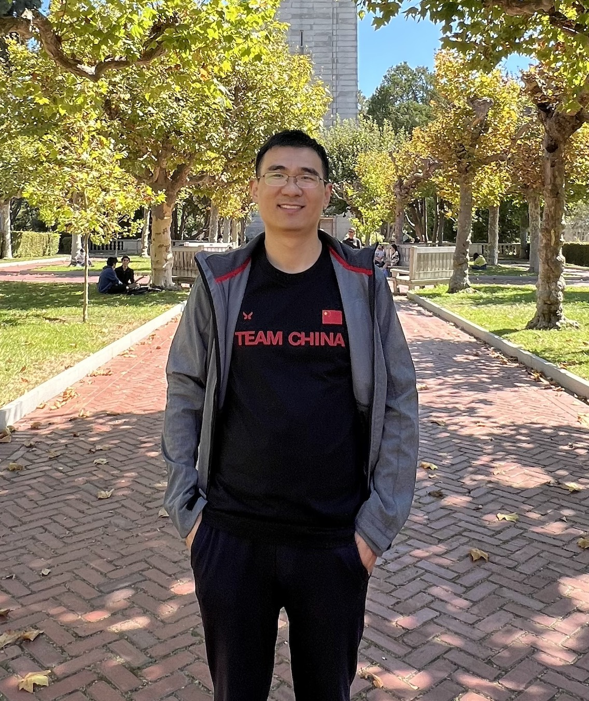

    

        <a href="/cn/">中文</a>
    

    <h1>Yuanqing Feng (冯园庆)</h1>

    

        

            I am a Research Associate at the <a href="https://www.med.upenn.edu/tishkoff/" target="_blank">University of Pennsylvania</a>. My research focuses on uncovering the genetic mechanisms underlying human evolution, phenotypic diversity, and disease susceptibility, with particular emphasis on the role of non-coding variants in human traits and diseases.

            With expertise in population genetics, functional genomics, and bioinformatics, I have developed an integrative approach that utilizes cutting-edge technologies including <a href="https://genomebiology.biomedcentral.com/articles/10.1186/s13059-023-02856-6" target="_blank">MPRA</a>, <a href="https://www.nature.com/articles/s41576-023-00583-z" target="_blank">Hi-C</a>, and <a href="https://www.synthego.com/learn/crispr" target="_blank">CRISPR genome editing</a> to efficiently identify functional mutations and their target genes, contributing novel insights into the molecular mechanisms of human complex traits.

            Before joining UPenn, I received my PhD in Molecular Medicine from <a href="https://www.pku.edu.cn/" target="_blank">Peking University</a> (2017) and BS in Biology from <a href="https://www.jlu.edu.cn/" target="_blank">Jilin University</a> (2011).

            

            Research Highlights:
            <ul style="list-style-type: none; padding-left: 0; margin-top: 0.5rem;">
                <li style="margin-bottom: 0.5rem;">• Elucidating TRIM72's role in cardiac energy metabolism (<a href="https://pubmed.ncbi.nlm.nih.gov/33744959/" target="_blank">MBE</a>)</li>
                <li style="margin-bottom: 0.5rem;">• Identifying genetic variants and genes in skin pigmentation (<a href="https://pubmed.ncbi.nlm.nih.gov/38200130/" target="_blank">Nature Genetics</a>)</li>
                <li style="margin-bottom: 0.5rem;">• Understanding local adaptation in African populations (<a href="https://pubmed.ncbi.nlm.nih.gov/36868214/" target="_blank">Cell</a>)</li>
            </ul>
            

        

        

            
        

    

    # Recent News
    

